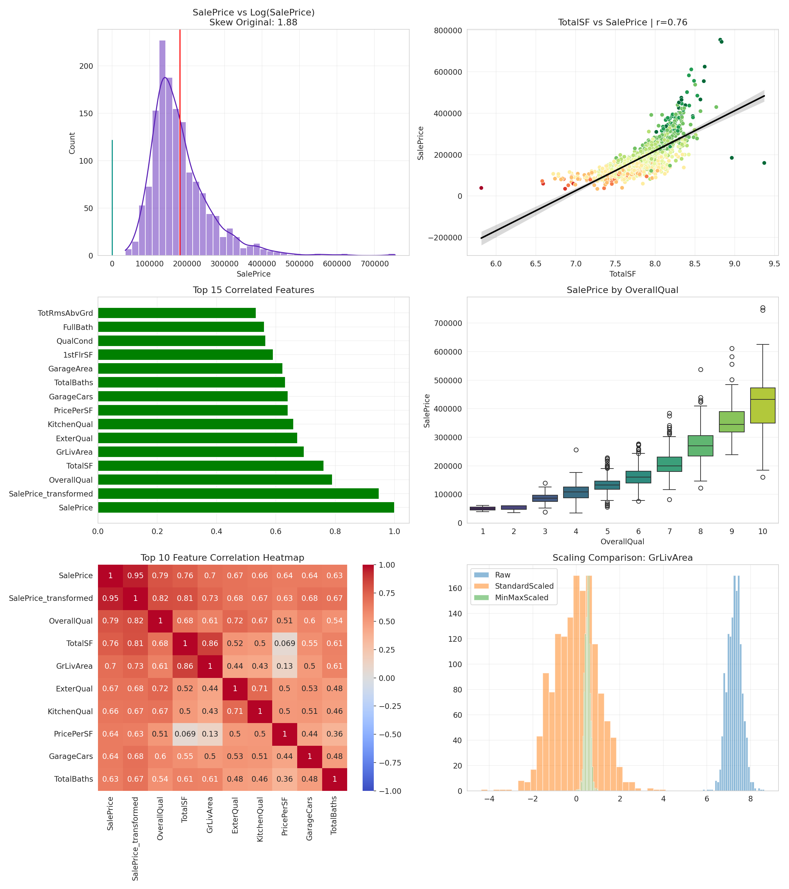

# AI/ML Internship Week 3 — Data Visualization & Feature Engineering

## 📊 Dataset
House Prices Dataset (Kaggle / Ames Housing Dataset)

---

## 🎯 Objective
To perform advanced data visualization and feature engineering to prepare data for machine learning models.

---

## 🔑 Key Findings

1. Overall Quality (`OverallQual`) is the strongest predictor of house price.
2. Engineered features like `TotalSF`, `PricePerSF`, and `TotalBaths` significantly improved correlation with SalePrice.
3. Log transformation reduced skewness and improved data distribution.
4. Neighborhood and location-based features strongly impact pricing trends.
5. Feature engineering improved model-ready structure of raw dataset.

---

## 🛠️ Feature Engineering Highlights

- TotalSF (combined living area)
- TotalBaths (weighted bathroom count)
- HouseAge (property age at sale)
- RemodelAge (time since renovation)
- QualCond (quality × condition interaction)
- PricePerSF (value density metric)
- IsNewHouse (recent construction indicator)
- HasRemodeled (binary renovation flag)

---

## 📦 Encoding Strategy

- Label Encoding: Ordinal quality features (ExterQual, KitchenQual, etc.)
- One-Hot Encoding: Nominal categorical features
- Frequency Encoding: High-cardinality features (Neighborhood)

---

## 📏 Scaling Methods Used

- StandardScaler
- MinMaxScaler
- RobustScaler

StandardScaler performed best for linear models.

---

## 📉 Tools & Libraries

- Python
- Pandas
- NumPy
- Matplotlib
- Seaborn
- Scikit-learn
- SciPy

---

## 📌 Dashboard Preview

---

## 🚀 Conclusion

This project demonstrates how visualization and feature engineering significantly improve data understanding and machine learning readiness.
